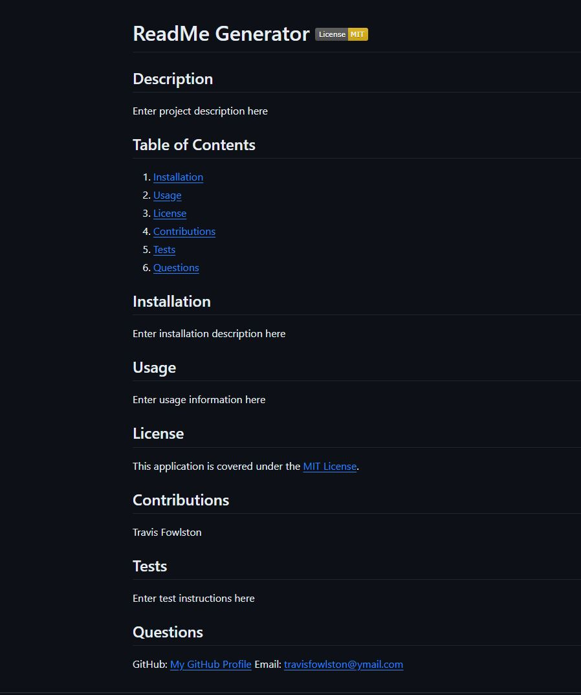

# Professional README Generator

## Project Description

The Module 9 Challenge objective was to create a command-line application that dynamically generates a professional README.md file from a user's input using the Inquirer package.

## Walkthrough Video

[Walkthrough Link](https://drive.google.com/file/d/1zYBbotsyfAcvzFFPRilXERp8Nf_asAFX/view?usp=sharing)

## Deployment Screenshot

## Comments

- Generates a high-quality, professional README.md is with the name of the project and sections entitled Description, Table of Contents, Installation, Usage, License, Contributing, Tests, and Questions.
- Generates a badge for the license that is selected and adds it near the top of the README.
- Generates a notice to the section of the README entitled License that explains which license the application is covered under.
- Creates a Table of Contents that takes you to the section of the README that was selected.
- Generates a link your GitHub profile and adds it to the section of the README entitled Questions.

## Credits

- Starter code was provided by the UC Davis Bootcamp.
- Project was completed by Travis Fowlston.

## License

- N/A
